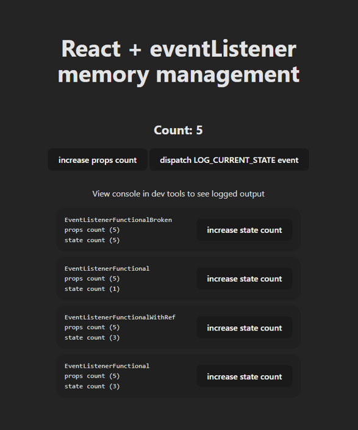

# React Prop/State Management When Dealing With Event Listeners

This project explores the challenge with memory handling in React when using event listeners. Solutions are provided alongside descriptions of their trade-offs.



# Run Project

Scenarios described below can be seen live in a sandbox [Vite](https://vitejs.dev/) project. Node.js version > 18 advised:

```console
$ npm i
$ npm run dev
```

# The Challenge With React and Event Listeners

[Event listeners](https://developer.mozilla.org/en-US/docs/Web/API/EventTarget/addEventListener) take a callback function that's attached to the listener.

```javascript
const callbackFn = () => {
  // ...
}

window.addEventListener('SOME_CUSTOM_EVENT', callbackFn)
```

If we need to use event listeners in React, we should create them inside `useEffect` to ensure they aren't re-created on subsequent re-renders. It's also likely that our `callbackFn` will need to reference props or state.

```javascript
const ExampleComponent = ({ count }) => {
  useEffect(() => {
    const callbackFn = () => console.log('count: ', count)

    window.addEventListener('SOME_CUSTOM_EVENT', callbackFn)

    return () => {
      window.removeEventListener('SOME_CUSTOM_EVENT', callbackFn)
    }
  }, [count])

  // {...}
}
```

Works ok. But we don't want to be creating/destroying event listeners as well as `callbackFn` every render, expecially if our component re-renders frequently. We could just remove the `[count]` dependency from `useEffect` so the event listeners are only created once, but now there's a bug because the value of `count` only ever logs its inital value. Check this yourself by viewing the output from `EventListenerFunctionalBroken.tsx`.

```diff
const ExampleComponent = ({ count }) => {
  useEffect(() => {
    const callbackFn = () => console.log('count: ', count)

    window.addEventListener('SOME_CUSTOM_EVENT', callbackFn)

    return () => {
      window.removeEventListener('SOME_CUSTOM_EVENT', callbackFn)
    }
-  }, [count])
+  }, [])

  // {...}
}
```

Output:

```console
# count props value is 0, logs 0
> "count: 0"

# count props updates to 1, logs 0
> "count: 0"

# count props updates to 2, logs 0
> "count: 0"
```

Fortunately, there are workarounds that don't require constantly destroying/creating event listeners/functions.

## Solution One: Functional Component + Refs

On a functional component, it's possible to copy props/state into a `ref`. Now the event listeners and callback function only get created once. The trade-off being that we need a duplicate copy of the props/state in memory.

```javascript
const ExampleComponent = ({ count }) => {
  const countRef = useRef(count)

  useEffect(() => {
    countRef.current = count
  }, [count])

  useEffect(() => {
    const callbackFn = () => console.log('count: ', countRef.current)

    window.addEventListener('SOME_CUSTOM_EVENT', callbackFn)

    return () => {
      window.removeEventListener('SOME_CUSTOM_EVENT', callbackFn)
    }
  }, [])

  // {...}
}
```

This trade-off is most apparent when `callbackFn` references state; two copies of the `count` value are required if we want to manage `count` with `useState`.

```javascript
const ExampleComponent = () => {
  const [count, setCount] = useState(0)

  const countRef = useRef(count)

  useEffect(() => {
    const callbackFn = () => console.log('count: ', count.current)

    window.addEventListener('SOME_CUSTOM_EVENT', callbackFn)

    return () => {
      window.removeEventListener('SOME_CUSTOM_EVENT', callbackFn)
    }
  }, [])

  useEffect(() => {
    countRef.current = count
  }, [count])

  // {...}
}
```

## Solution Two: Class Component

With a class component, the only trade-off is that we aren't using a functional component (which is most people's preference).

The memory management in class components means no work around is required to reference up-to-date prop/state values.

```javascript
class EventListenerClass extends React.Component {
  constructor(props) {
    super(props)

    this.callBackFn = this.callBackFn.bind(this)
  }

  callBackFn() {
    console.log('count: ', this.props.count)
  }

  componentDidMount(): void {
    window.addEventListener('SOME_CUSTOM_EVENT', this.callBackFn)
  }

  componentWillUnmount(): void {
    window.removeEventListener('SOME_CUSTOM_EVENT', this.callBackFn)
  }

  //  ...
}
```

It also works with internal state.

```javascript
class EventListenerClass extends React.Component {
  constructor() {
    this.callBackFn = this.callBackFn.bind(this)
  }

  state = {
    count: 0,
  }

  callBackFn() {
    console.log('count: ', this.state.count)
  }

  componentDidMount(): void {
    window.addEventListener('SOME_CUSTOM_EVENT', this.callBackFn)
  }

  componentWillUnmount(): void {
    window.removeEventListener('SOME_CUSTOM_EVENT', this.callBackFn)
  }

  //  methods to update state

  // {...}
}
```

# Feedback

I hope you find these examples interesting and useful. Please forward any feedback or comments: ijrexweb@gmail.com.
